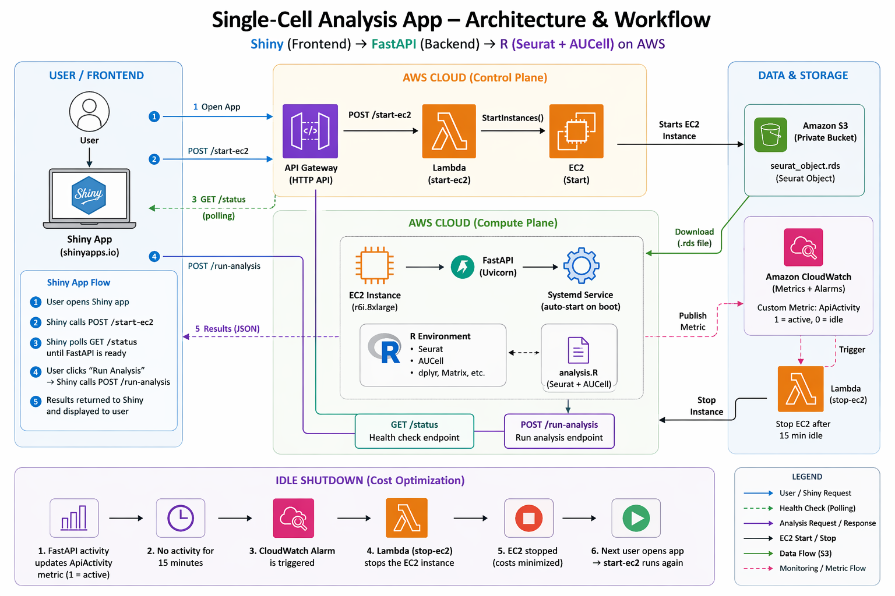
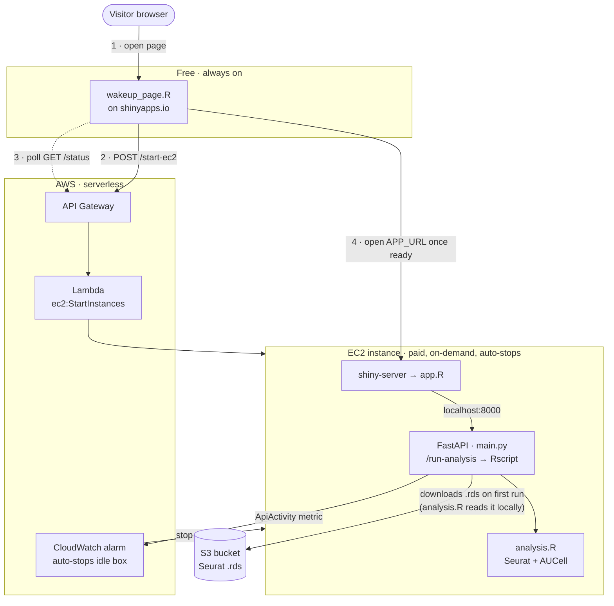

# NRP snRNA-seq Explorer

An interactive web app for exploring single-nucleus RNA-seq (snRNA-seq) data from
iPSC-derived motoneuron (iMN) differentiation. A user pastes in a list of genes and the
app shows, on a UMAP, **how active that gene program is** across cells and **which cells
have it switched on** — with statistics broken down by timepoint and cluster.

- **Contact:** tyron@wustl.edu
- **Public URL:** https://nrp-snrna-seq.shinyapps.io/NRP-snRNA-seq_app/

---

## Design

The app is built around one main idea: **the heavy compute server is expensive, so keep it
off until someone actually needs it.** That single constraint explains every moving part.



### The wake-on-demand architecture



**Why two front-ends?**
- `frontend/wakeup_page.R` is a tiny page hosted **free** on shinyapps.io. Its only job is to
  wake the EC2 box (via API Gateway) and then redirect the visitor to the real app. It is the
  public entry point.
- `frontend/app.R` is the **real** app (all the plots and UI). It only runs on the EC2 box, served
  by shiny-server, and talks to the backend at `localhost:8000`.

Keeping the public page separate means the expensive EC2 instance can stay **stopped (and unbilled)**
whenever nobody is using it. A CloudWatch alarm watches the `ApiActivity` metric that `main.py`
emits and stops the instance once it goes idle.

**Why a separate Python backend instead of doing the analysis in Shiny?**
The analysis needs Seurat + AUCell on a large `.rds` object. `backend/main.py` (FastAPI) runs each
request as an **async background job**: it returns a `job_id` immediately, runs `analysis.R` in a
subprocess, and the front-end **polls** `/result/{job_id}` every 4 seconds. This keeps the UI
responsive and lets the slow R computation run without blocking Shiny.

### What the app computes

| Tab | Question it answers | Method |
|-----|---------------------|--------|
| **Gene Activity Score** | "How strongly is this gene program expressed in each cell?" | Seurat `AddModuleScore` → UMAP heatmap + per-group violin plot |
| **Find Active Cells** | "Which cells have this program turned **on** (yes/no)?" | `AUCell` enrichment + adjustable sensitivity threshold → UMAPs + significance bar charts |

A preset **Motoneuron gene list (Yadav et al.)** is built in for one-click testing.

---

## Repo layout

```
.
├── frontend/
│   ├── wakeup_page.R     Public landing page (shinyapps.io). Wakes EC2, polls /status, redirects.
│   ├── app.R             The real Shiny app (runs on EC2 via shiny-server). All plots & UI.
│   └── .Renviron.example Template for the infra URLs the wake-up page needs (copy to .Renviron).
│
└── backend/              Everything that runs on the EC2 instance
    ├── main.py           FastAPI server. Endpoints: /status, /run-analysis, /result/{job_id}.
    ├── analysis.R        The computation: Seurat AddModuleScore + AUCell. Called by main.py.
    ├── download_rds.py   One-off helper to pre-pull the Seurat .rds from S3.
    ├── requirements.txt  Python dependencies for the backend.
    └── fastapi.service   systemd unit so the backend runs as a service and restarts on crash.
```

> **Not in this repo (but required to run in production):** the API Gateway + Lambda behind
> `POST /start-ec2` and `GET /status`, the CloudWatch auto-stop alarm, the `backend/.env` secrets,
> and the `.rds` data file (it lives in S3).

---

## Runtime workflow (what happens on a visit)

1. A visitor opens the shinyapps.io page → `wakeup_page.R` loads.
2. Its JavaScript calls `POST {API_BASE}/start-ec2`, which triggers a Lambda that starts the EC2 box.
3. The page polls `GET {API_BASE}/status` every 5s, showing a progress bar ("Instance is booting…").
4. Once `/status` returns ready, the page opens `APP_URL` → the real `app.R` on EC2.
5. In `app.R`, the user enters genes and clicks **Compute Score** / **Find Active Cells**.
6. `app.R` calls `POST localhost:8000/run-analysis` → gets a `job_id`.
7. `main.py` runs `analysis.R` in the background; `app.R` polls `GET /result/{job_id}` every 4s.
8. When done, the JSON result comes back and the plots render. After idle time, CloudWatch stops the box.

---

## Configuration

### Front-end infra URLs (kept out of git)
`wakeup_page.R` reads two values from the environment so the real URLs are **never committed**:

| Variable | Meaning |
|----------|---------|
| `NRP_API_BASE` | API Gateway base URL (the `/start-ec2` + `/status` wake-up endpoints) |
| `NRP_APP_URL`  | Public address of the running app on EC2 (e.g. `http://<ip>:3838/nrp/`) |

Set them up by copying the template:
```bash
cp frontend/.Renviron.example frontend/.Renviron   # then fill in the real values
```
`.Renviron` is gitignored (so it stays out of source control) but is still bundled to shinyapps.io
on deploy, which is what makes the app work. Alternatively, set the two variables in the
shinyapps.io dashboard instead of using a file.

> ⚠️ These URLs are sent to the visitor's browser at runtime (the page has to call them), so they
> are visible via View-Source / Network tab. Keeping them out of git protects the *repo*, not the
> deployed page. To stop strangers from actually starting your EC2 box, lock down API Gateway with
> an API key + throttling (AWS-side).

### Backend environment (`backend/.env` on the EC2 box)
`main.py` reads these and refuses to start if any are missing:

```dotenv
AWS_REGION=us-east-2
S3_BUCKET=nrp-snrna-seq
S3_KEY=iMN/all_WT_iMN_no_harmony_040826.rds
LOCAL_RDS=/home/ec2-user/backend/all_WT_iMN_no_harmony_040826.rds
R_SCRIPT=/home/ec2-user/backend/analysis.R
CW_NAMESPACE=NRP/ShinyApp
```

---

## Deploy workflow (production)

**A. EC2 compute box**
1. Launch EC2 (Amazon Linux, user `ec2-user`) with an IAM role allowing `s3:GetObject` on the data
   bucket and `cloudwatch:PutMetricData`.
2. Install R + shiny-server, Python 3.10+, and the package deps (`requirements.txt`; Seurat/AUCell for R).
3. Copy `backend/` to `/home/ec2-user/backend/` and create `backend/.env` (see above).
4. Run the backend as a service:
   ```bash
   sudo cp backend/fastapi.service /etc/systemd/system/
   sudo systemctl daemon-reload
   sudo systemctl enable --now fastapi
   ```
5. Put `frontend/app.R` where shiny-server serves it (e.g. `/srv/shiny-server/nrp/app.R`) so it is
   reachable at `http://<EC2-IP>:3838/nrp/`.

**B. Wake-up / auto-stop infra** (currently configured only in the AWS console — see note above)
- API Gateway + Lambda for `POST /start-ec2` (`ec2:StartInstances`) and `GET /status`.
- CloudWatch alarm on `NRP/ShinyApp → ApiActivity` that stops the idle instance.

**C. Public landing page**
- Set `NRP_API_BASE` and `NRP_APP_URL`, then publish `frontend/wakeup_page.R` to shinyapps.io.

---

## Backend API reference

| Method | Path | Purpose |
|--------|------|---------|
| `GET`  | `/status` | `ready` if `analysis.R` exists and shiny-server is active, else `503 starting` |
| `POST` | `/run-analysis` | Body `{mode, genes, name}`, `mode` ∈ `"score"`/`"auc"`. Returns `{job_id}` |
| `GET`  | `/result/{job_id}` | `{"status":"running"}`, the result JSON when done, or `500` with error detail |

Jobs run asynchronously in a background thread; the front-end polls `/result/{job_id}` every 4s.
